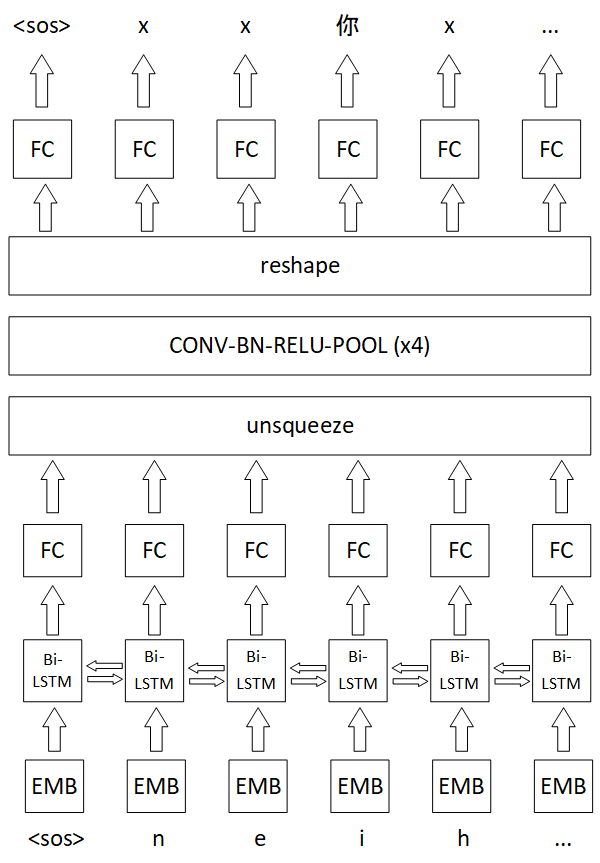

# pinyin2hanzi

基於深度學習的拼音轉漢字

原項目地址 [ranchlai/pinyin2hanzi](https://github.com/ranchlai/pinyin2hanzi)

> 註：用於輸入法，具備音節切分、簡拼功能。本文中的示例使用的是粵語拼音，例如你 (nei) 好 (hou)。



## 運行

### 克隆本倉庫

```cmd
git clone https://github.com/sgalal/pinyin2hanzi.git
cd pinyin2hanzi
```

### 安裝依賴

需要 Python 3.7 環境。

```cmd
pip install -r requirements.txt
```

### 下載語料並進行預處理

下載語料：

```sh
wget -P input https://raw.githubusercontent.com/sgalal/git-lfs-test/master/data_yuewiki.txt
wget -P input https://raw.githubusercontent.com/sgalal/git-lfs-test/master/data_rthk_1.txt
wget -P input https://raw.githubusercontent.com/sgalal/git-lfs-test/master/data_aishell_transcript.txt
```

預處理：

```cmd
python process_transcript.py
```

註：預處理部分的程式碼因為反覆修改，可能難以閲讀，此處將程式碼功能描述如下：

生成以下四個檔案。

- `data/ai_shell_train_sd.han`
- `data/ai_shell_train_sd.pinyin`
- `data/ai_shell_dev_sd.han`
- `data/ai_shell_dev_sd.pinyin`

其中，以 `.han` 結尾者的格式如下：

```
x二xxx零xx一xx四xx年xx新xxxx疆xx的xxx房xx地xxx產
xx機xx器xx人xxx大xx世xxx界xx在xx本xxx屆xx博xxx覽xx會xx後xxxx將xx不xx會xx撤xx館
xx打xx造x互xxx聯xxx網xx加xx機xx器xx人xxx交xx易xx服xx務xxx大xxx平xx台
xx各xx地xxx政x府xx便xx紛xx紛xx跟xxx進
```

以 `.pinyin` 結尾者的格式如下：

```
jilingjatseininsangoengdikfongdeicaan
geiheijandaaisaigaaizoibungaaiboklaamkuihauzoengbatkuicitgun
daazouwulyunmonggaageiheijangaaujikfukmoudaaipingtoi
gokdeizingfubinfanfanganzeon
```

### 訓練模型

訓練模型。

這一步亦會生成兩個檔案，供下一步讀取：

- `data/han_vocab_sd.txt`
- `data/py_vocab_sd.txt`

```cmd
python train.py
```

### 預測

```cmd
python run_inference.py
```

## TRAINING DATA

As a light-weight example, training data are downloaded from the AI shell speech recognition corpus, 
found in http://openslr.org/33/. The transcripts rather than the audio data are used. A copy of the transcript file is found in the ./data folder

## Reference

Some of the code borrowed from https://github.com/bentrevett/pytorch-seq2seq

Model architecture was designed by myself. It is very likely that the model looks partly the same as some existing works, I apologized for not citing them. Please let me know if you think I should cite some papers.
